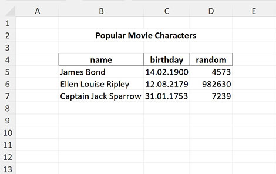

[](https://packagist.org/packages/avadim/fast-excel-reader)
[](https://packagist.org/packages/avadim/fast-excel-reader)
[](https://packagist.org/packages/avadim/fast-excel-reader)
[](https://packagist.org/packages/avadim/fast-excel-reader)

# FastExcelReader

**FastExcelReader** is a part of the FastExcelPhp Project which consists of

* [FastExcelWriter](https://packagist.org/packages/avadim/fast-excel-writer) - to create Excel spreadsheets
* [FastExcelReader](https://packagist.org/packages/avadim/fast-excel-reader) - to reader Excel spreadsheets
* [FastExcelTemplator](https://packagist.org/packages/avadim/fast-excel-templator) - to generate Excel spreadsheets from XLSX templates
* [FastExcelLaravel](https://packagist.org/packages/avadim/fast-excel-laravel) - special **Laravel** edition

## Introduction

This library is designed to be lightweight, super-fast and requires minimal memory usage.

**FastExcelReader** can read Excel compatible spreadsheets in XLSX format (Office 2007+).
It only reads data, but it does it very quickly and with minimal memory usage.

**Features**

* Supports XLSX format only (Office 2007+) with multiple worksheets
* Supports autodetect currency/numeric/date types
* Supports auto formatter and custom formatter of datetime values
* The library can define and extract images from XLSX files
* The library can read styling options of cells - formatting patterns, colors, borders, fonts, etc.

## Installation

Use `composer` to install **FastExcelReader** into your project:

```
composer require avadim/fast-excel-reader
```

Jump to:
* [Simple example](#simple-example)
* [Read values row by row in loop](#read-values-row-by-row-in-loop)
* [Keys in resulting arrays](#keys-in-resulting-arrays)
* [Advanced example](#advanced-example)
* [Date Formatter](#date-formatter)
* [Images functions](#images-functions)
* [Cell value types](#cell-value-types)
* [How to get complete info about the cell style](#how-to-get-complete-info-about-the-cell-style)
* [Some useful methods](#some-useful-methods)

## Usage

You can find more examples in */demo* folder

### Simple example

```php
use \avadim\FastExcelReader\Excel;

$file = __DIR__ . '/files/demo-00-simple.xlsx';

// Open XLSX-file
$excel = Excel::open($file);
// Read all values as a flat array from current sheet
$result = $excel->readCells();
```
You will get this array:
```text
Array
(
    [A1] => 'col1'
    [B1] => 'col2'
    [A2] => 111
    [B2] => 'aaa'
    [A3] => 222
    [B3] => 'bbb'
)
```

```php
// Read all rows in two-dimensional array (ROW x COL)
$result = $excel->readRows();
```
You will get this array:
```text
Array
(
    [1] => Array
        (
            ['A'] => 'col1'
            ['B'] => 'col2'
        )
    [2] => Array
        (
            ['A'] => 111
            ['B'] => 'aaa'
        )
    [3] => Array
        (
            ['A'] => 222
            ['B'] => 'bbb'
        )
)
```

```php
// Read all columns in two-dimensional array (COL x ROW)
$result = $excel->readColumns();
```
You will get this array:
```text
Array
(
    [A] => Array
        (
            [1] => 'col1'
            [2] => 111
            [3] => 222
        )

    [B] => Array
        (
            [1] => 'col2'
            [2] => 'aaa'
            [3] => 'bbb'
        )

)
```

### Read values row by row in loop
```php
$sheet = $excel->sheet();
foreach ($sheet->nextRow() as $rowNum => $rowData) {
    // $rowData is array ['A' => ..., 'B' => ...]
    $addr = 'C' . $rowNum;
    if ($sheet->hasImage($addr)) {
        $sheet->saveImageTo($addr, $fullDirectoryPath);
    }
    // handling of $rowData here
    // ...
}

// OR
foreach ($sheet->nextRow() as $rowNum => $rowData) {
    // handling of $rowData here
    // ...
    // get image list from current row
    $imageList = $sheet->getImageListByRow();
    foreach ($imageList as $imageInfo) {
        $imageBlob = $sheet->getImageBlob($imageInfo['address']);
    }
}

// OR
foreach ($sheet->nextRow(['A' => 'One', 'B' => 'Two'], Excel::KEYS_FIRST_ROW) as $rowNum => $rowData) {
    // $rowData is array ['One' => ..., 'Two' => ...]
    // ...
}
```

### Keys in resulting arrays
```php
// Read rows and use the first row as column keys
$result = $excel->readRows(true);
```
You will get this result:
```text
Array
(
    [2] => Array
        (
            ['col1'] => 111
            ['col2'] => 'aaa'
        )
    [3] => Array
        (
            ['col1'] => 222
            ['col2'] => 'bbb'
        )
)
```
The optional second argument specifies the result array keys
```php

// Rows and cols start from zero
$result = $excel->readRows(false, Excel::KEYS_ZERO_BASED);
```
You will get this result:
```text
Array
(
    [0] => Array
        (
            [0] => 'col1'
            [1] => 'col2'
        )
    [1] => Array
        (
            [0] => 111
            [1] => 'aaa'
        )
    [2] => Array
        (
            [0] => 222
            [1] => 'bbb'
        )
)
```
Allowed values of result mode

| mode options        | descriptions                                                                    |
|---------------------|---------------------------------------------------------------------------------|
| KEYS_ORIGINAL       | rows from '1', columns from 'A' (default)                                       |
| KEYS_ROW_ZERO_BASED | rows from 0                                                                     |
| KEYS_COL_ZERO_BASED | columns from 0                                                                  |
| KEYS_ZERO_BASED     | rows from 0, columns from 0 (same as KEYS_ROW_ZERO_BASED + KEYS_COL_ZERO_BASED) |
| KEYS_ROW_ONE_BASED  | rows from 1                                                                     |
| KEYS_COL_ONE_BASED  | columns from 1                                                                  |
| KEYS_ONE_BASED      | rows from 1, columns from 1 (same as KEYS_ROW_ONE_BASED + KEYS_COL_ONE_BASED)   |

Additional options that can be combined with result modes

| options         | descriptions                                 |
|-----------------|----------------------------------------------|
| KEYS_FIRST_ROW  | the same as _true_ in the first argument     |
| KEYS_RELATIVE   | index from top left cell of area (not sheet) |
| KEYS_SWAP       | swap rows and columns                        |

For example
```php

$result = $excel->readRows(['A' => 'bee', 'B' => 'honey'], Excel::KEYS_FIRST_ROW | Excel::KEYS_ROW_ZERO_BASED);
```
You will get this result:
```text
Array
(
    [0] => Array
        (
            [bee] => 111
            [honey] => 'aaa'
        )

    [1] => Array
        (
            [bee] => 222
            [honey] => 'bbb'
        )

)
```

### Advanced example
```php
use \avadim\FastExcelReader\Excel;

$file = __DIR__ . '/files/demo-02-advanced.xlsx';

$excel = Excel::open($file);

$result = [
    'sheets' => $excel->getSheetNames() // get all sheet names
];

$result['#1'] = $excel
    // select sheet by name
    ->selectSheet('Demo1') 
    // select area with data where the first row contains column keys
    ->setReadArea('B4:D11', true)  
    // set date format
    ->setDateFormat('Y-m-d') 
    // set key for column 'C' to 'Birthday'
    ->readRows(['C' => 'Birthday']); 

// read other arrays with custom column keys
// and in this case we define range by columns only
$columnKeys = ['B' => 'year', 'C' => 'value1', 'D' => 'value2'];
$result['#2'] = $excel
    ->selectSheet('Demo2', 'B:D')
    ->readRows($columnKeys);

$result['#3'] = $excel
    ->setReadArea('F5:H13')
    ->readRows($columnKeys);
```
You can set read area by defined names in workbook. For example if workbook has defined name **Headers** with range **Demo1!$B$4:$D$4**
then you can read cells by this name

```php
$excel->setReadArea('Values');
$cells = $excel->readCells();
```
Note that since the value contains the sheet name, this sheet becomes the default sheet.

You can set read area in the sheet
```php
$sheet = $excel->getSheet('Demo1')->setReadArea('Headers');
$cells = $sheet->readCells();
```
But if you try to use this name on another sheet, you will get an error
```php
$sheet = $excel->getSheet('Demo2')->setReadArea('Headers');
// Exception: Wrong address or range "Values"

```

If necessary, you can fully control the reading process using the method ```readSheetCallback()``` with callback-function
```php
use \avadim\FastExcelReader\Excel;

$excel = Excel::open($file);

/**
 * A callback function that gets the value of each cell 
 *
 * @param int $row Row number
 * @param string $col Column char
 * @param mixed $val Cell value
 *
 * @return bool
 */
function readCellCallback($row, $col, $val)
{
    // Function implementation

    // if the function returns true then data reading is interrupted  
    return false;
}

$excel->readCallback('readCellCallback');
```

### Date Formatter
By default, all datetime values returns as timestamp. But you can change this behavior using ```dateFormatter()```


```php
$excel = Excel::open($file);
$sheet = $excel->sheet()->setReadArea('B5:D7');
$cells = $sheet->readCells();
echo $cells['C5']; // -2205187200

// If argument TRUE is passed, then all dates will be formatted as specified in cell styles
// IMPORTANT! The datetime format depends on the locale
$excel->dateFormatter(true);
$cells = $sheet->readCells();
echo $cells['C5']; // '14.02.1900'

// You can specify date format pattern
$excel->dateFormatter('Y-m-d');
$cells = $sheet->readCells();
echo $cells['C5']; // '1900-02-14'

// set date formatter function
$excel->dateFormatter(fn($value) => gmdate('m/d/Y', $value));
$cells = $sheet->readCells();
echo $cells['C5']; // '02/14/1900'

// returns DateTime instance
$excel->dateFormatter(fn($value) => (new \DateTime())->setTimestamp($value));
$cells = $sheet->readCells();
echo get_class($cells['C5']); // 'DateTime'

// custom manipulations with datetime values
$excel->dateFormatter(function($value, $format, $styleIdx) use($excel) {
    // get Excel format of the cell, e.g. '[$-F400]h:mm:ss\ AM/PM'
    $excelFormat = $excel->getFormatPattern($styleIdx);

    // get format converted for use in php functions date(), gmdate(), etc
    // for example the Excel pattern above would be converted to 'g:i:s A'
    $phpFormat = $excel->getDateFormatPattern($styleIdx);
    
    // and if you need you can get value of numFmtId for this cell
    $style = $excel->getCompleteStyleByIdx($styleIdx, true);
    $numFmtId = $style['format-num-id'];
    
    // do something and write to $result
    $result = gmdate($phpFormat, $value);

    return $result;
});
```

### Images functions
```php
// Returns count images on all sheets
$excel->countImages();

// Returns count images on sheet
$sheet->countImages();

// Returns image list of sheet
$sheet->getImageList();

// Returns image list of specified row
$sheet->getImageListByRow($rowNumber);

// Returns TRUE if the specified cell has an image
$sheet->hasImage($cellAddress);

// Returns mime type of image in the specified cell (or NULL)
$sheet->getImageMimeType($cellAddress);

// Returns inner name of image in the specified cell (or NULL)
$sheet->getImageName($cellAddress);

// Returns an image from the cell as a blob (if exists) or NULL
$sheet->getImageBlob($cellAddress);

// Writes an image from the cell to the specified filename
$sheet->saveImage($cellAddress, $fullFilenamePath);

// Writes an image from the cell to the specified directory
$sheet->saveImageTo($cellAddress, $fullDirectoryPath);
```

## Cell value types

The library tries to determine the types of cell values, and in most cases it does it right. 
Therefore, you get numeric or string values. Date values are returned as a timestamp by default.
But you can change this behavior by setting the date format (see the formatting options for the date() php function).

```php
$excel = Excel::open($file);
$result = $excel->readCells();
print_r($result);
```
The above example will output:
```text
Array
(
    [B2] => -2205187200
    [B3] => 6614697600
    [B4] => -6845212800
)
```
```php
$excel = Excel::open($file);
$excel->setDateFormat('Y-m-d');
$result = $excel->readCells();
print_r($result);
```
The above example will output:
```text
Array
(
    [B2] => '1900-02-14'
    [B3] => '2179-08-12'
    [B4] => '1753-01-31'
)
```

## How to get complete info about the cell style 

Usually read functions return just cell values, but you can read the values with styles.
In this case, for each cell, not a scalar value will be returned, but an array 
like ['v' => _scalar_value_, 's' => _style_array_, 'f' => _formula_]

```php
$excel = Excel::open($file);

$sheet = $excel->sheet();

$rows = $sheet->readRowsWithStyles();
$columns = $sheet->readColumnsWithStyles();
$cells = $sheet->readCellsWithStyles();

$cells = $sheet->readCellsWithStyles();
```
Or you can read styles only (without values)
```php
$cells = $sheet->readCellStyles();
/*
array (
  'format' => 
  array (
    'format-num-id' => 0,
    'format-pattern' => 'General',
  ),
  'font' => 
  array (
    'font-size' => '10',
    'font-name' => 'Arial',
    'font-family' => '2',
    'font-charset' => '1',
  ),
  'fill' => 
  array (
    'fill-pattern' => 'solid',
    'fill-color' => '#9FC63C',
  ),
  'border' => 
  array (
    'border-left-style' => NULL,
    'border-right-style' => NULL,
    'border-top-style' => NULL,
    'border-bottom-style' => NULL,
    'border-diagonal-style' => NULL,
  ),
)
 */
$cells = $sheet->readCellStyles(true);
/*
array (
  'format-num-id' => 0,
  'format-pattern' => 'General',
  'font-size' => '10',
  'font-name' => 'Arial',
  'font-family' => '2',
  'font-charset' => '1',
  'fill-pattern' => 'solid',
  'fill-color' => '#9FC63C',
  'border-left-style' => NULL,
  'border-right-style' => NULL,
  'border-top-style' => NULL,
  'border-bottom-style' => NULL,
  'border-diagonal-style' => NULL,
)
 */
```
But we do not recommend using these methods with large files

## Some useful methods
### Excel object
* ```getSheetNames()``` -- Returns names array of all sheets
* ```sheet(?string $name = null)``` -- Returns default or specified sheet
* ```getSheet(string $name, ?string $areaRange = null, ?bool $firstRowKeys = false)``` -- Get sheet by name
* ```getSheetById(int $sheetId, ?string $areaRange = null, ?bool $firstRowKeys = false)``` -- Get sheet by id
* ```getFirstSheet(?string $areaRange = null, ?bool $firstRowKeys = false)``` -- Get the first sheet
* ```selectSheet(string $name, ?string $areaRange = null, ?bool $firstRowKeys = false)``` -- Select default sheet by name and returns it
* ```selectSheetById(int $sheetId, ?string $areaRange = null, ?bool $firstRowKeys = false)``` -- Select default sheet by id and returns it
* ```selectFirstSheet(?string $areaRange = null, ?bool $firstRowKeys = false)``` -- Select the first sheet as default and returns it
* ```getDefinedNames()``` -- Returns defined names of workbook

### Sheet object
* ```name()``` -- Returns name of string
* ```dimension()``` -- Returns dimension of default work area from sheet properties
* ```countRows()``` -- Count rows from dimension
* ```countColumns()``` -- Count columns from dimension
* ```firstRow()``` -- The first row number
* ```firstCol()``` -- The first column letter
* ```readFirstRow()``` -- Returns values of cells of 1st row as array
* ```readFirstRowWithStyles()``` -- Returns values and styles of cells of 1st row as array

## Do you want to support FastExcelReader?

if you find this package useful you can give me a star on GitHub.

Or you can donate me :)
* USDT (TRC20) TSsUFvJehQBJCKeYgNNR1cpswY6JZnbZK7
* USDT (ERC20) 0x5244519D65035aF868a010C2f68a086F473FC82b
* ETH 0x5244519D65035aF868a010C2f68a086F473FC82b