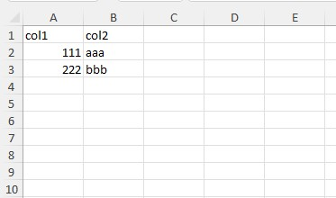

# FastExcelReader

This php-class can read Excel compatible spreadsheets in XLSX format (Office 2007+). 
It only reads data, but it does it very quickly and with minimal memory usage.

If you want to read colors, formats and other properties you need use **PhpSpreadsheet**. 
But if you only want data then your choice is **FastExcelReader**.

By the way, **FastExcelWriter** also exists - https://github.com/aVadim483/fast-excel-writer

## Installation

Use `composer` to install **FastExcelReader** into your project:

```
composer require avadim/fast-excel-reader
```

Also you can download package and include autoload file of the library:
```php
require 'path/to/fast-excel-writer/src/autoload.php';
```

## Usage

You can find more examples in */demo* folder

### Simple example

```php
use \avadim\FastExcelReader\Excel;

$file = __DIR__ . '/files/demo-00-simple.xlsx';

// Open XLSX-file
$excel = Excel::open($file);
// Read all values as a flat array
$result = $excel->readCells();
// You will get this array:
```
You will get this array:
```text
Array
(
    [A1] => 'col1'
    [B1] => 'col2'
    [A2] => 111
    [B2] => 'aaa'
    [A3] => 222
    [B3] => 'bbb'
)
```

```php
// Read all rows in two-dimensional array 
$result = $excel->readRows();
```
You will get this array:
```text
Array
(
    [1] => Array
        (
            ['A'] => 'col1'
            ['B'] => 'col2'
        )
    [2] => Array
        (
            ['A'] => 111
            ['B'] => 'aaa'
        )
    [3] => Array
        (
            ['A'] => 222
            ['B'] => 'bbb'
        )
)
```

```php
// Read all columns in two-dimensional array 
$result = $excel->readColumns();
```
You will get this array:
```text
Array
(
    [A] => Array
        (
            [1] => 'col1'
            [2] => 111
            [3] => 222
        )

    [B] => Array
        (
            [1] => 'col2'
            [2] => 'aaa'
            [3] => 'bbb'
        )

)
```

### Keys in resulting arrays
```php
// Read rows and use the first row as column keys
$result = $excel->readRows(true);
```
You will get this result:
```text
Array
(
    [2] => Array
        (
            ['col1'] => 111
            ['col2'] => 'aaa'
        )
    [3] => Array
        (
            ['col1'] => 222
            ['col2'] => 'bbb'
        )
)
```
The optional second argument specifies the result array keys
```php

// Read rows and use the first row as column keys
$result = $excel->readRows(false, Excel::KEYS_ZERO_BASED);
```
You will get this result:
```text
Array
(
    [0] => Array
        (
            [0] => 'col1'
            [1] => 'col2'
        )
    [1] => Array
        (
            [0] => 111
            [1] => 'aaa'
        )
    [2] => Array
        (
            [0] => 222
            [1] => 'bbb'
        )
)
```
Allowed values of index style

| style options       | descriptions                                                                    |
|---------------------|---------------------------------------------------------------------------------|
| KEYS_ORIGINAL       | rows from '1', columns from 'A' (default)                                       |
| KEYS_ROW_ZERO_BASED | rows from 0                                                                     |
| KEYS_COL_ZERO_BASED | columns from 0                                                                  |
| KEYS_ZERO_BASED     | rows from 0, columns from 0 (same as KEYS_ROW_ZERO_BASED + KEYS_COL_ZERO_BASED) |
| KEYS_ROW_ONE_BASED  | rows from 1                                                                     |
| KEYS_COL_ONE_BASED  | columns from 1                                                                  |
| KEYS_ONE_BASED      | rows from 1, columns from 1 (same as KEYS_ROW_ONE_BASED + KEYS_COL_ONE_BASED)   |

Additional options that can be combined with index styles

| options         | descriptions                                 |
|-----------------|----------------------------------------------|
| KEYS_FIRST_ROW  | the same as _true_ in the first argument     |
| KEYS_RELATIVE   | index from top left cell of area (not sheet) |
| KEYS_SWAP       | swap rows and columns                        |

For example
```php

$result = $excel->readRows(['A' => 'bee', 'B' => 'honey'], Excel::KEYS_FIRST_ROW | Excel::KEYS_ROW_ZERO_BASED);
```
You will get this result:
```text
Array
(
    [0] => Array
        (
            [bee] => 111
            [honey] => 'aaa'
        )

    [1] => Array
        (
            [bee] => 222
            [honey] => 'bbb'
        )

)
```

### Advanced example
```php
use \avadim\FastExcelReader\Excel;

$file = __DIR__ . '/files/demo-02-advanced.xlsx';

$excel = Excel::open($file);

$result = [
    'sheets' => $excel->getSheetNames() // get all sheet names
];

$result['#1'] = $excel
    // select sheet by name
    ->selectSheet('Demo1') 
    // select area with data where the first row contains column keys
    ->setReadArea('B4:D11', true)  
    // set date format
    ->setDateFormat('Y-m-d') 
    // set key for column 'C' to 'Birthday'
    ->readRows(['C' => 'Birthday']); 

// read other arrays with custom column keys
$columnKeys = ['B' => 'year', 'C' => 'value1', 'D' => 'value2'];
$result['#2'] = $excel
    ->selectSheet('Demo2', 'B5:D13')
    ->readRows($columnKeys);

$result['#3'] = $excel
    ->setReadArea('F5:H13')
    ->readRows($columnKeys);
```
If necessary, you can fully control the reading process using the method ```readSheetCallback``` with callback-function
```php
use \avadim\FastExcelReader\Excel;

$excel = Excel::open($file);

/**
 * A callback function that gets the value of each cell 
 *
 * @param int $row Row number
 * @param string $col Column char
 * @param mixed $val Cell value
 *
 * @return bool
 */
function readCellCallback($row, $col, $val)
{
    // Function implementation

    // if the function returns true then data reading is interrupted  
    return false;
}

$excel->readSheetCallback('readCellCallback');
```

## Want to support FastExcelReader?

if you find this package useful you can support and donate to me https://www.paypal.me/VShemarov
Or just give me star on GitHub :)