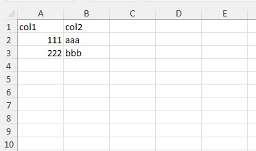

# Getting Started

[← Back to README](../README.md) | [Documentation index](../README.md#documentation) | [🇷🇺 Русский](ru/10-getting-started.md)

## Simple example

```php
use \avadim\FastExcelReader\Excel;

$file = __DIR__ . '/files/demo-00-simple.xlsx';

// Open a spreadsheet: the reader is chosen by the file signature, so XLSX,
// legacy XLS (Office 97-2003) and CSV are all opened the same way.
// See docs/21-xls.md and docs/20-csv.md for what differs per format.
$excel = Excel::open($file);
// Read all values as a flat array from current sheet
$result = $excel->readCells();
```
You will get this array:
```text
Array
(
    [A1] => 'col1'
    [B1] => 'col2'
    [A2] => 111
    [B2] => 'aaa'
    [A3] => 222
    [B3] => 'bbb'
)
```

```php
// Read all rows in two-dimensional array (ROW x COL)
$result = $excel->readRows();
```
You will get this array:
```text
Array
(
    [1] => Array
        (
            ['A'] => 'col1'
            ['B'] => 'col2'
        )
    [2] => Array
        (
            ['A'] => 111
            ['B'] => 'aaa'
        )
    [3] => Array
        (
            ['A'] => 222
            ['B'] => 'bbb'
        )
)
```

```php
// Read all columns in two-dimensional array (COL x ROW)
$result = $excel->readColumns();
```
You will get this array:
```text
Array
(
    [A] => Array
        (
            [1] => 'col1'
            [2] => 111
            [3] => 222
        )

    [B] => Array
        (
            [1] => 'col2'
            [2] => 'aaa'
            [3] => 'bbb'
        )

)
```

## Open from a string or a stream

A workbook does not have to live on disk. When the bytes are already in memory —
a database blob, an HTTP response body, an S3/Flysystem read — open them directly:

```php
// From a string (e.g. a BLOB column)
$excel = Excel::openString($blob);

// From an open stream resource (URL, php://memory, Flysystem read stream)
$stream = fopen('https://example.com/report.xlsx', 'rb');
$excel = Excel::openStream($stream);
fclose($stream); // the caller keeps ownership of the stream
```

Both pick the reader by signature exactly like `open()`, so a string or stream
holding XLSX, XLS or CSV reads back identically to the same file on disk. They
accept the same `$options` as `open()` (e.g. `['format' => 'csv']`). Internally
the content is copied to a temporary file, which is removed on script shutdown.

## See also

* [Reading Data](11-reading-data.md) — row by row, array keys, empty cells
* [Advanced Reading](12-advanced-reading.md) — read areas, defined names, callbacks
* [API Reference](90-api-reference.md)
