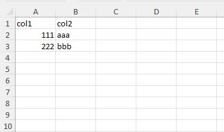

# Начало работы

[🇬🇧 English](../10-getting-started.md) · [← К README](../../README.ru.md) · [Оглавление](../../README.ru.md#документация)

## Простой пример

```php
use \avadim\FastExcelReader\Excel;

$file = __DIR__ . '/files/demo-00-simple.xlsx';

// Открыть XLSX-файл
$excel = Excel::open($file);
// Прочитать все значения текущего листа как плоский массив
$result = $excel->readCells();
```
Вы получите такой массив:
```text
Array
(
    [A1] => 'col1'
    [B1] => 'col2'
    [A2] => 111
    [B2] => 'aaa'
    [A3] => 222
    [B3] => 'bbb'
)
```

```php
// Прочитать все строки в двумерный массив (СТРОКА x КОЛОНКА)
$result = $excel->readRows();
```
Вы получите такой массив:
```text
Array
(
    [1] => Array
        (
            ['A'] => 'col1'
            ['B'] => 'col2'
        )
    [2] => Array
        (
            ['A'] => 111
            ['B'] => 'aaa'
        )
    [3] => Array
        (
            ['A'] => 222
            ['B'] => 'bbb'
        )
)
```

```php
// Прочитать все колонки в двумерный массив (КОЛОНКА x СТРОКА)
$result = $excel->readColumns();
```
Вы получите такой массив:
```text
Array
(
    [A] => Array
        (
            [1] => 'col1'
            [2] => 111
            [3] => 222
        )

    [B] => Array
        (
            [1] => 'col2'
            [2] => 'aaa'
            [3] => 'bbb'
        )

)
```

## Смотрите также

* [Чтение данных](11-reading-data.md) — построчно, ключи массивов, пустые ячейки
* [Продвинутое чтение](12-advanced-reading.md) — области чтения, именованные диапазоны, колбэки
* [Справочник API](../90-api-reference.md)
