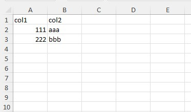

# Начало работы

[🇬🇧 English](../10-getting-started.md) · [← К README](../../README.ru.md) · [Оглавление](../../README.ru.md#документация)

## Выбор способа открытия

Начиная с 4.5, используйте явную фабрику, если формат или уровень API известен:

| Метод | Возвращает | Назначение |
|---|---|---|
| `Excel::open($file, $options)` | `AbstractBook` | Определить XLSX/XLS/CSV по содержимому |
| `Excel::openXlsx($file)` | `Excel` | Открыть именно XLSX, без перехода к CSV |
| `Excel::openXls($file)` | `XlsBook` | Открыть XLS BIFF8 |
| `Excel::openCsvBook($file, $options)` | `CsvBook` | CSV через общий API книги и листа |
| `Excel::openCsvReader($file, $options)` | `CsvReader` | Низкоуровневый CSV-движок |

Опции CSV принимают массив, `CsvOptions` или null. Явные CSV-фабрики допускают пустой
CSV; универсальный `open()` отклоняет пустой вход. Принудительный формат в `open()`
поддерживается только для `['format' => 'csv']`; для XLSX/XLS используйте явные фабрики.

**Подготовка к 5.0:** в 4.x `openCsv()` по-прежнему возвращает `CsvReader`, но в 5.0
планируется возврат `CsvBook`. Замените низкоуровневые вызовы на `openCsvReader()`,
чтобы сохранить методы `getCsvLine()` и `fromRow()`. Для API книги и листа выбирайте
`openCsvBook()`; метод `getReader()` этой книги также даёт доступ к движку.

`isXlsx()` проверяет сигнатуру ZIP, а `isXls()` — OLE2; это не доказательство того,
что контейнер содержит поддерживаемую книгу. `validate()` проверяет обязательные части
XLSX и корректность XML, но не полную схему OOXML и не правильность формул.

## Простой пример

```php
use \avadim\FastExcelReader\Excel;

$file = __DIR__ . '/files/demo-00-simple.xlsx';

// Открыть таблицу: ридер выбирается по сигнатуре файла, поэтому XLSX, устаревший
// XLS (Office 97-2003) и CSV открываются одинаково.
// Об отличиях по форматам — см. docs/ru/21-xls.md и docs/ru/20-csv.md
$excel = Excel::open($file);
// Прочитать все значения текущего листа как плоский массив
$result = $excel->readCells();
```
Вы получите такой массив:
```text
Array
(
    [A1] => 'col1'
    [B1] => 'col2'
    [A2] => 111
    [B2] => 'aaa'
    [A3] => 222
    [B3] => 'bbb'
)
```

```php
// Прочитать все строки в двумерный массив (СТРОКА x КОЛОНКА)
$result = $excel->readRows();
```
Вы получите такой массив:
```text
Array
(
    [1] => Array
        (
            ['A'] => 'col1'
            ['B'] => 'col2'
        )
    [2] => Array
        (
            ['A'] => 111
            ['B'] => 'aaa'
        )
    [3] => Array
        (
            ['A'] => 222
            ['B'] => 'bbb'
        )
)
```

```php
// Прочитать все колонки в двумерный массив (КОЛОНКА x СТРОКА)
$result = $excel->readColumns();
```
Вы получите такой массив:
```text
Array
(
    [A] => Array
        (
            [1] => 'col1'
            [2] => 111
            [3] => 222
        )

    [B] => Array
        (
            [1] => 'col2'
            [2] => 'aaa'
            [3] => 'bbb'
        )

)
```

## Открытие из строки или потока

Таблица не обязана лежать на диске. Когда байты уже в памяти — BLOB из базы, тело
HTTP-ответа, чтение из S3/Flysystem — их можно открыть напрямую:

```php
// Из строки (например, из BLOB-колонки)
$excel = Excel::openString($blob);

// Из открытого потока (URL, php://memory, поток чтения Flysystem)
$stream = fopen('https://example.com/report.xlsx', 'rb');
$excel = Excel::openStream($stream);
fclose($stream); // поток остаётся во владении вызывающего кода
```

Оба выбирают ридер по сигнатуре, ровно как `open()`, поэтому строка или поток с
XLSX, XLS или CSV читаются так же, как тот же файл с диска. Принимают те же
`$options`, что и `open()` (например, `['format' => 'csv']`). Внутри содержимое
копируется во временный файл, который удаляется при завершении скрипта.

Поток читается с текущей позиции, без rewind; non-seekable потоки поддерживаются.
Входной поток остаётся собственностью вызывающего кода даже при ошибке. Неудачная
запись или копирование вызывают исключение и удаляют созданный временный файл.
Без ожидаемой длины или контрольной суммы библиотека не может обнаружить внешнее
усечение, если сам поток сообщил об успешном конце данных.

`Excel::validate($file, $errors)` возвращает XML-диагностику текущего вызова в `$errors`.
Отсутствие обязательных частей XLSX даёт false без XML-ошибок, ошибка открытия архива —
исключение. Режим `libxml_use_internal_errors` восстанавливается; общий буфер libxml
очищается до и после проверки. Если нужны предыдущие ошибки, сохраните их перед вызовом.

## Смотрите также

* [Чтение данных](11-reading-data.md) — построчно, ключи массивов, пустые ячейки
* [Продвинутое чтение](12-advanced-reading.md) — области чтения, именованные диапазоны, колбэки
* [Справочник API](../90-api-reference.md)
