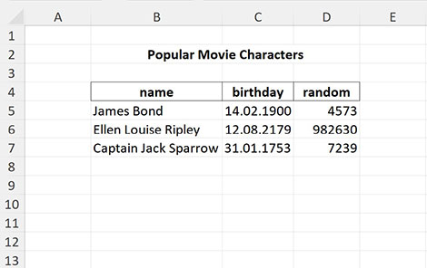
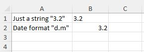

# Типы значений ячеек и форматирование дат

[🇬🇧 English](../13-dates-and-types.md) · [← К README](../../README.ru.md) · [Оглавление](../../README.ru.md#документация)

* [Форматирование дат](#форматирование-дат)
* [Типы значений ячеек](#типы-значений-ячеек)

## Форматирование дат
По умолчанию все значения даты-времени возвращаются как timestamp. Но это поведение можно изменить с помощью ```dateFormatter()```


```php
$excel = Excel::open($file);
$sheet = $excel->sheet()->setReadArea('B5:D7');
$cells = $sheet->readCells();
echo $cells['C5']; // -2205187200

// Если передать аргумент TRUE, все даты будут отформатированы так, как задано в стилях ячеек
// ВАЖНО! Формат даты-времени зависит от локали
$excel->dateFormatter(true);
$cells = $sheet->readCells();
echo $cells['C5']; // '14.02.1900'

// Можно указать шаблон формата даты
$excel->dateFormatter('Y-m-d');
$cells = $sheet->readCells();
echo $cells['C5']; // '1900-02-14'

// задать функцию-форматтер даты
$excel->dateFormatter(fn($value) => gmdate('m/d/Y', $value));
$cells = $sheet->readCells();
echo $cells['C5']; // '02/14/1900'

// вернуть экземпляр DateTime
$excel->dateFormatter(fn($value) => (new \DateTime())->setTimestamp($value));
$cells = $sheet->readCells();
echo get_class($cells['C5']); // 'DateTime'

// произвольные манипуляции со значениями даты-времени
$excel->dateFormatter(function($value, $format, $styleIdx) use($excel) {
    // получить Excel-формат ячейки, например '[$-F400]h:mm:ss\ AM/PM'
    $excelFormat = $excel->getFormatPattern($styleIdx);

    // получить формат, преобразованный для использования в php-функциях date(), gmdate() и т.д.
    // например, приведённый выше Excel-шаблон будет преобразован в 'g:i:s A'
    $phpFormat = $excel->getDateFormatPattern($styleIdx);
    
    // и при необходимости можно получить значение numFmtId для этой ячейки
    $style = $excel->getCompleteStyleByIdx($styleIdx, true);
    $numFmtId = $style['format-num-id'];
    
    // сделать что-нибудь и записать в $result
    $result = gmdate($phpFormat, $value);

    return $result;
});
```
Иногда, если формат ячейки задан как дата, но не содержит даты, библиотека может неверно интерпретировать это значение. Чтобы этого избежать, можно отключить форматирование дат



Здесь ячейка B1 содержит строку "3.2", а ячейка B2 — дату 2024-02-03, но обеим ячейкам задан формат даты

```php
$excel = Excel::open($file);
// режим по умолчанию
$cells = $sheet->readCells();
echo $cell['B1']; // -2208798720 - библиотека пытается интерпретировать число 3.2 как timestamp
echo $cell['B2']; // 1706918400 - timestamp даты 2024-02-03

// форматтер дат включён
$excel->dateFormatter(true);
$cells = $sheet->readCells();
echo $cell['B1']; // '03.01.1900'
echo $cell['B2']; // '3.2'

// форматтер дат выключен
$excel->dateFormatter(false);
$cells = $sheet->readCells();
echo $cell['B1']; // '3.2'
echo $cell['B2']; // 1706918400 - timestamp даты 2024-02-03

```

## Типы значений ячеек

Библиотека пытается определить типы значений ячеек и в большинстве случаев делает это верно.
Поэтому вы получаете числовые или строковые значения. Значения дат по умолчанию возвращаются как timestamp.
Но это поведение можно изменить, задав формат даты (см. опции форматирования для php-функции date()).

```php
$excel = Excel::open($file);
$result = $excel->readCells();
print_r($result);
```
Приведённый выше пример выведет:
```text
Array
(
    [B2] => -2205187200
    [B3] => 6614697600
    [B4] => -6845212800
)
```
```php
$excel = Excel::open($file);
$excel->setDateFormat('Y-m-d');
$result = $excel->readCells();
print_r($result);
```
Приведённый выше пример выведет:
```text
Array
(
    [B2] => '1900-02-14'
    [B3] => '2179-08-12'
    [B4] => '1753-01-31'
)
```

## Смотрите также

* [Стили ячеек](14-cell-styles.md)
* [Справочник API](../90-api-reference.md)
